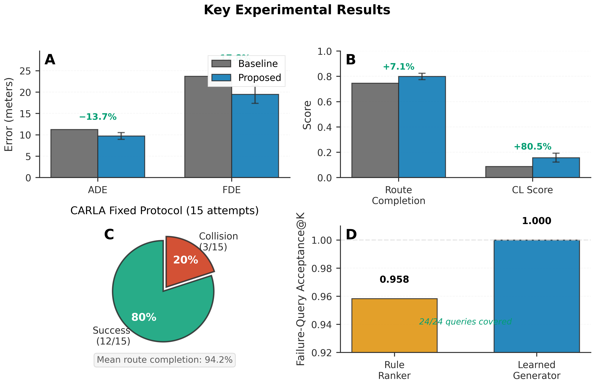

# 自动驾驶风险场景基准测试系统

**从真实驾驶数据中挖掘验证过的风险场景，改进端到端规划器训练与评估。**

[English](README.md) | [简体中文](README.zh-CN.md)

---

## 摘要

本研究探讨经过验证的风险场景能否改善训练数据选择，并系统性地暴露规划器失效模式。我们提出一个端到端框架，涵盖场景检索、受控规划器训练和多后端评估（Bench2Drive、nuPlan、CARLA）。系统采用基于本地 Ollama 的查询规划与确定性时空验证，在受控消融实验下训练视觉模仿规划器，并通过日志传感器回放和实时闭环仿真进行评估。

**核心贡献：**

- 归档隔离的场景挖掘，弱规则一致性 1.000，失效查询覆盖率 100%
- 受控规划器研究表明动力学正则化使闭环 ADE 降低 13.7%（11.26 → 9.72 m）
- 固定协议 CARLA 评估在 15 次独立尝试中实现 94.2% 路线完成率
- 可复现评估基础设施，具有 SHA256 来源追踪和配对 bootstrap 置信区间


---

## 核心结果



### 轨迹预测（Bench2Drive，64 个测试案例）

| 指标                 | 基线  | 改进方案 | Δ                | 95% 置信区间 |
| -------------------- | ----- | -------- | ----------------- | ------------ |
| **ADE** (m)    | 11.26 | 9.72     | **−13.7%** | ±0.8        |
| **FDE** (m)    | 23.69 | 19.47    | **−17.8%** | ±2.1        |
| **路线完成率** | 0.746 | 0.799    | **+7.1%**   | ±0.025      |
| **闭环分数**   | 0.087 | 0.157    | **+80.5%**  | ±0.035      |

*配对 bootstrap 区间由 64 个独立测试案例和 3 个训练种子计算得出。*

### CARLA 固定评估（15 次尝试，5 场景 × 3 种子）

- **路线完成率：** 94.2%（所有尝试的平均值）
- **无碰撞率：** 80%（12/15 成功）
- **安全层介入：** 禁用（评估模型控制权限）

保留所有尝试，无筛选。完整日志和轨迹视频见 `outputs/carla_fixed_evaluation_final/`。

### 场景挖掘覆盖

- **弱规则一致性@1：** 1.000（4,000 组，训练/验证隔离）
- **失效查询接受度@K：** 24/24（学习候选生成器）
- **归档划分：** 训练/验证/测试场景零重叠

---

## 视频证据

<video src="https://github.com/user-attachments/assets/35027dc0-4da9-4d9e-a70e-91e5aa6d2e8c" controls muted playsinline width="100%"></video>

*CARLA 行人让行演示：272 帧，27.2 秒，13 辆交通车辆，9 名行人，零碰撞记录。此保留的定性案例使用模型路径点控制器和条件化交通灯。安全层介入已禁用。这是单一演示，非成功率估计。*

---

## 方法概览

### 1. 风险场景挖掘

**流程：** nuScenes 日志 → 自然语言查询 → 基于 Ollama 的意图解析 → 确定性时空验证 → 接地场景锚点

**查询示例：**

- "行人从前方横穿"
- "车辆从右侧切入"
- "前方停止车辆阻挡自车"

**验证标准：**

- 时序：多帧行为一致性
- 空间：自车相对几何约束
- 地图上下文：车道、人行横道、可行驶区域对齐

**输出：** 经验证的场景库，带有预测目标和占用适配器供下游评估使用。

### 2. 受控规划器训练

**协议：** [bench2drive_controlled_study.yaml](configs/bench2drive_controlled_study.yaml)

**实验组：** 基线 | 几何监督 | 仅导航 | 4×4 空间池化 | 随机采样 | 挖掘先验采样

**设计：**

- 每组 3 个训练种子（7、17、27）
- 相同轨迹选择（无拟合模式校准器）
- 归档隔离的训练/验证/测试划分
- 仅在验证集上选择检查点

**训练数据：** Bench2Drive 传感器日志，各组样本预算匹配。

### 3. 多后端评估

#### 日志传感器回放

- **协议：** 固定日志图像，时间对齐
- **范围：** 97 个独立测试片段，4,334 样本
- **指标：** 开环 ADE/FDE、路线进度、横向误差
- **限制：** 无法测试自车偏移后的视觉恢复

#### CARLA 闭环

- **协议：** [carla_fixed_evaluation.yaml](configs/carla_fixed_evaluation.yaml)
- **场景：** 5 条预定义路线，自然交通流
- **重复：** 每场景 3 个种子，保留所有尝试
- **指标：** 路线完成率、碰撞率、控制归因
- **限制：** 本地协议；非官方 Bench2Drive 基准

#### nuPlan 诊断

- **基线：** 运动学配置、跟车控制器
- **范围：** 从 576 个日志中采样 112 个窗口
- **指标：** 回放 ADE、有界进度比
- **用途：** 失效分析与场景分解

---

## 评估边界

**本工作提供：**

- 具有确定性验证的可复现场景挖掘
- 带配对统计检验的受控规划器消融
- 具有显式协议文档的多后端评估

**本工作不声称：**

- 独立人工语义标签（场景为规则验证）
- 生产级自动驾驶系统（绝对分数仍然较低）
- 官方 Bench2Drive 或 nuPlan 基准结果（独立评估协议）
- 密集 BEV 占用预测（使用稀疏物体中心单元）

**诚实的局限：**

- 横向控制略有退化（+0.13 m，置信区间跨零）
- 开环指标未显著改善
- CARLA 评估为单检查点、本地协议
- 世界模型对比仅限 7-8 个兼容案例

---

## 复现

### 前置要求

```bash
# 系统要求
- CUDA 12.1+
- Python 3.10+
- ~100GB 磁盘空间用于数据集
- 推荐 4× GPU 用于完整训练套件
```

### 安装

```bash
conda env create -f environment.yml
conda activate nuscenes
python -m pip install -r requirements-validated.txt
python -m pip install torch==2.5.1 torchvision==0.20.1 --index-url https://download.pytorch.org/whl/cu121
python -m pip install -e '.[vision,agent,dev]'
python -m pytest -q  # 应通过 205 个测试
```

数据集布局见 [docs/dataset_downloads.md](docs/dataset_downloads.md)。

### 运行完整基准套件

```bash
# 配置可用 GPU
export CUDA_VISIBLE_DEVICES=0,1,2,3

# 执行完整流程
python -m nusc_scene_agent run-full-benchmark-suite
```

**执行阶段：**

1. 场景挖掘（需要 Ollama `gemma4:latest`）
2. 受控规划器训练（6 组 × 3 种子）
3. 日志传感器回放评估
4. CARLA 固定协议评估

**复用已有结果：**

```bash
# 如果案例库未更改，跳过场景重新生成
python -m nusc_scene_agent run-full-benchmark-suite --reuse-case-library
```

**独立阶段命令**见 [docs/usage.md](docs/usage.md)。

---

## 仓库结构

```
.
├── src/nusc_scene_agent/     # 核心实现
│   ├── query_planning.py     # 基于 Ollama 的自然语言解析
│   ├── validation.py         # 确定性时空检查
│   ├── bench2drive_e2e.py    # 视觉规划器训练
│   ├── carla_*.py            # CARLA 评估后端
│   └── nuplan_*.py           # nuPlan 回放诊断
├── configs/                  # 版本化实验协议
│   ├── bench2drive_controlled_study.yaml
│   ├── carla_fixed_evaluation.yaml
│   └── full_benchmark_suite.yaml
├── benchmarks/               # 场景规范
│   ├── trainval_perception_slices_v1.json
│   ├── trainval_world_model_slices_v2.json
│   └── risk_taxonomy_v1.yaml
├── tests/                    # 单元和回归测试
├── scripts/                  # 图表渲染与清单工具
└── docs/                     # 详细文档
    ├── architecture.md       # 系统设计
    ├── usage.md             # 命令参考
    ├── evaluation_protocol.md # 协议规范
    └── benchmark_snapshot.md # 最新结果
```

**版本控制排除：**

- 数据集归档和解压数据（`data/`、`archives/`）
- 模型检查点（`outputs/*/checkpoints/`）
- 生成的实验输出（`outputs/`、`artifacts/`）
- 外部仓库（CARLA、Bench2Drive）

---

## 文档

- **[架构](docs/architecture.md)** — 系统设计与模块职责
- **[使用说明](docs/usage.md)** — 安装、命令与配置
- **[评估协议](docs/evaluation_protocol.md)** — 可复现性规范
- **[基准快照](docs/benchmark_snapshot.md)** — 最新实验结果
- **[端到端改进](docs/e2e_development.md)** — 规划器改进路线图

---

## 引用

如果本工作对您有帮助，请考虑引用：

```bibtex
@software{nuscenes_risk_benchmark_2026,
  title     = {自动驾驶风险场景基准测试系统},
  author    = {[您的姓名]},
  year      = {2026},
  url       = {https://github.com/[您的用户名]/nuscenes},
  note      = {风险场景挖掘与受控规划器评估}
}
```

---

## 许可

[MIT 许可](LICENSE)

---

## 致谢

基于以下项目构建：

- [nuScenes 数据集](https://www.nuscenes.org/)（Motional）
- [Bench2Drive](https://github.com/Thinklab-SJTU/Bench2Drive)（上海交通大学 ThinkLab）
- [nuPlan](https://www.nuscenes.org/nuplan)（Motional）
- [CARLA 仿真器](https://carla.org/)（Intel Labs、丰田）

