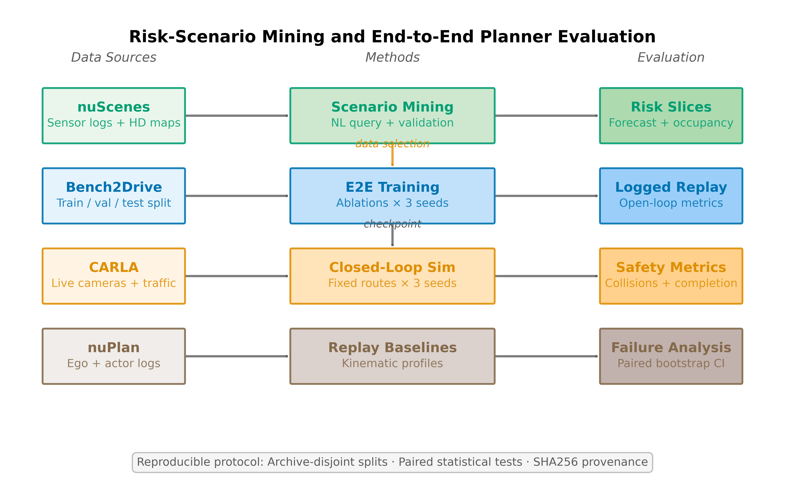

# Architecture Notes

## System Goal

The system tests whether validated risk scenarios improve data selection and expose planner failures. `nuScenes` provides mined anchors and a scenario-family prior, `Bench2Drive` supports controlled visual-planner experiments, `nuPlan` supplies replay baselines, and `CARLA` supplies fixed live-camera evaluations. A retained demonstration is separate qualitative evidence.

## Controlled Experiments

`bench2drive_study.py` executes the configured training seeds and ablation arms, selects checkpoints on validation data, and evaluates every held-out test clip. Training arms use fixed trajectory selection without fitted mode calibration. The data-selection comparison uses the same training sample budget and unchanged validation/test sets; half of the risk-prior sampling probability remains uniform to preserve unmapped families.

`bench2drive_closed_loop.py` is a logged-sensor replay diagnostic. Predictions remain attached to the logged ego pose. State integration uses actual source-frame spacing, while metrics compare states at the same timestamps. The reference route includes only observed poses within the evaluated horizon. Fixed images cannot provide visual feedback after simulated drift; the protocol is not a simulator driving benchmark.

`carla_fixed_evaluation.py` freezes scenario configurations and seeds before execution. Each attempt runs in an isolated process. Completed failures and infrastructure errors are retained, and the summary reports errors separately. The fixed protocol disables safety overrides, lane-departure guards and traffic-light conditioning. It still uses navigation features and a low-level waypoint controller.

The weak retriever partitions all scenes before sampling negative candidates. Reports include both positive and negative scene identities and enforce zero scene overlap. Its labels and features remain rule-derived; consistency metrics are not independent semantic accuracy.

`forecast_validation_study` filters official nuScenes validation scenes before mining, preserves the original actor anchors, and applies the same continuity requirements to ContextVAE and motion baselines. Paired uncertainty resamples scenes rather than treating multiple actors from one scene as independent. This validation slice is excluded from development failure-query generation.

The target workflow is:

1. describe a risk scenario in natural language
2. map the description to a scenario family in [configs/scenario_taxonomy.yaml](../configs/scenario_taxonomy.yaml)
3. retrieve or instantiate matching cases from the appropriate backend
4. validate them with deterministic checks
5. export evidence figures, reports, benchmark summaries, and model-evaluation artifacts

## Pipeline

### 1. Offline indexing

- parse `nuScenes` samples, annotations, ego poses, and map metadata
- build a compact `SQLite` index for fast candidate retrieval
- record schema name, schema version, dataset version, and dataroot in index metadata
- keep the runtime compact for repeated experiments

### 2. Query planning

- `rule` mode uses a deterministic parser over scene-language patterns
- `llm` mode asks a local Ollama model to produce structured constraints
- `hybrid` mode evaluates multiple query hypotheses instead of unconditionally merging planner outputs

## 3. Retrieval

- filter and score candidates using actor type, relative position, behavior labels, and temporal context
- compute the retrieval score with vectorized `pandas`/`numpy` operations over the candidate frame
- keep retrieval score weights in a named constant so result metadata and audits can reference the active scoring profile
- run `default` and `equal` score profiles through the same query suite and export sensitivity artifacts
- support scenario families such as `crossing`, `cut_in`, `oncoming`, and `stopped_lead`
- batch temporal feature loading where needed to avoid large-query `SQLite` failures
- use a recorded nearest-distance prefilter (`candidate_scan_limit=50,000` by default); setting it to `0` enables a full scan for exact retrieval at higher cost

## 4. Validation

- compute geometry and relative motion features
- estimate risk-related signals such as proximity and TTC
- use map context for lane relation, road direction, crosswalk preference, and walkway support
- keep validation deterministic so benchmark behavior is inspectable and reproducible
- export validation component scores, score weights, pass-gate thresholds, and behavior thresholds with each validated case
- separate continuous validation quality from the binary acceptance gate; accepted cases take precedence for benchmark selection, while ungated maxima remain diagnostic only
- load all context agents at the anchor sample instead of applying a fixed top-k truncation
- localize the critical event window with start, end, and peak sample indices
- export grounded primary-actor metadata for scenario-level reporting

## 5. Reporting

- export `Markdown` and `HTML` summaries
- generate BEV evidence images
- write case-library artifacts and benchmark metrics
- surface failure-pattern groupings and benchmark-profile comparisons
- export reference-aware scenario-mining artifacts such as event windows and grounded actors
- export scenario-group summaries that score anchor consistency across paraphrases
- export leaderboard-style HTML and CSV artifacts for profile comparison and behavior-level failure analysis
- export static benchmark browsers that link query summaries, case reports, and evidence figures across profiles
- support explicit ablation studies over reranking, map context, and event localization
- export scenario-conditioned perception slices and model-agnostic evaluation summaries for external BEV tracking outputs
- export sparse BEV occupancy slices for primary and context actor coverage analysis
- export scenario-conditioned world-model slices with future trajectory and occupancy supervision
- export replay-ready JSONL assets and MCAP assets for offline system testing
- export compact `nuPlan` replay-regression cases from SQLite scenario tags
- export cross-split `nuPlan` closed-loop replay summaries
- export Ollama-generated benchmark review reports from local artifacts
- export unified risk-case collections, benchmark-layer registries, dataset-backend inventories, and artifact manifests
- export a result registry that summarizes completed benchmark layers and key metrics

## 6. Counterfactual Benchmark Generation

The benchmark generator supports counterfactual expansion from validated case libraries.

The generator:

- selects diverse anchor cases from an existing case library
- creates positive canonical and paraphrase variants
- creates actor-swap and behavior-swap negatives
- keeps explicit `reference_case_keys` for objective evaluation
- carries reference event windows for localization-aware scoring when the source case provides event localization

This extends case retrieval into benchmark construction and contrastive evaluation.

## 7. Scenario Mining Benchmark Layer

The scenario-mining layer derives reference-aware benchmark targets from validated case libraries.

This layer keeps explicit:

- reference scene names
- reference actor instance tokens
- reference event start and end sample indices
- reference event peak sample indices

That allows the metrics layer to move beyond generic retrieval scores and report scenario-mining-style outputs such as:

- scene-level objective@1 and objective@K
- actor-level objective@1 and objective@K
- event-window overlap
- peak-sample localization error

## 8. Scenario-Conditioned Perception Benchmark Layer

The perception layer derives compact evaluation slices from scenario-mining anchors.

This layer exports:

- short event-window actor trajectories in ego coordinates
- anchor sample indices and event-window bounds
- behavior and actor labels inherited from validated scenario-mining cases
- benchmark-side risk facets such as distance band, TTC band, visibility band, map relation, and occlusion proxy

That makes it possible to score external detector or tracker outputs on mined risk slices with metrics such as:

- anchor recall
- full-track success
- event recall
- contiguous temporal coverage
- first-match lag
- center localization error

The layer also includes:

- an adapter from official `nuScenes` detection and tracking JSON into the local slice-evaluation schema
- greedy temporal linking for detection-only outputs so short event windows can still be evaluated without native track IDs
- coverage-aware benchmark filtering so split-specific prediction files can be aligned to the subset they actually cover
- per-case `CSV`, `JSON`, `Markdown`, and `HTML` exports for downstream analysis

## 9. Risk-Conditioned BEV Occupancy Benchmark Layer

The BEV occupancy layer derives sparse occupancy slices from the perception benchmark and the indexed `nuScenes` actor table.

This layer keeps:

- event-window sample tokens and sample indices
- primary risk actor occupancy cells
- context actor occupancy cells
- union occupancy cells over a fixed ego-frame BEV grid
- inherited behavior labels and risk facets

The evaluation layer reports:

- occupancy IoU
- primary actor recall
- context recall
- anchor-frame occupancy IoU
- composite risk-fidelity score

This layer uses sparse center-cell occupancy labels to test whether perception outputs cover the risk actor and nearby dynamic context on mined event windows.

## 10. Scenario-Conditioned World-Model Benchmark Layer

The world-model layer derives compact prediction targets from the perception-slice layer.

This layer keeps:

- a short observed history up to the rollout anchor
- a short future horizon for the primary risk actor in ego coordinates
- sparse future occupancy targets for the primary actor and surrounding context actors
- benchmark-side risk facets inherited from the validated case anchor

That makes it possible to score future rollouts with metrics such as:

- full-horizon success
- horizon recall
- average displacement error
- final displacement error
- occupancy IoU
- closest-approach distance error
- closest-approach timing error
- composite risk-fidelity score

The layer also includes:

- proxy rollout generators for controlled studies
- an adapter for compact external rollout formats keyed by benchmark group or reference case
- an adapter for `nuScenes prediction challenge` style multi-modal forecast outputs keyed by `(instance, sample)`
- per-case `CSV`, `JSON`, `Markdown`, and `HTML` evaluation exports
- multi-profile comparison exports for behavior-wise and risk-wise analysis
- challenge-track breakdowns for benchmark-style reporting
- qualitative case-study rendering for benchmark-aligned trajectory comparisons
- replay export as newline-delimited JSON and `MCAP`

## 11. nuPlan Replay-Regression Extension

The `nuPlan` extension reads local SQLite logs directly and constructs compact replay-regression cases from scenario tags.

Each case stores:

- an anchor lidar timestamp and scenario tag
- a scenario-family taxonomy, difficulty label, and risk-facet summary
- ego history and future ego states
- a primary risk actor when the tag is agent-specific
- traffic-light status counts for the replay window
- risk targets such as minimum actor distance, minimum TTC, and collision-proxy consistency
- comfort targets such as maximum acceleration, jerk, and yaw rate
- automatic `history_kinematic` ego rollouts estimated from pre-anchor ego motion

The evaluation layer compares predicted ego rollouts against logged replay windows with:

- full-horizon coverage
- ego ADE and FDE
- minimum-distance error to the primary actor
- minimum-TTC error
- red-light context recall
- acceleration, jerk, and yaw-rate errors
- collision-proxy mismatch
- composite risk-fidelity score
- profile comparison summaries and leaderboard CSV exports
- cross-split and city-level sweep summaries
- failure-taxonomy CSV exports by profile, scenario family, tag, and difficulty
- qualitative replay case-study figures with per-profile trajectory overlays

This extension is a compact regression harness for simulation-style testing while preserving the main scope of dataset indexing, scenario mining, and benchmark generation.

## 12. nuPlan Closed-Loop Replay

The closed-loop replay extension uses the same mined `nuPlan` replay cases, but rolls the ego state forward with planner profiles instead of reading the future ego state from the log at each step.

The simulation loop keeps:

- logged actors and traffic-light context from the replay window
- simulated ego state from the previous planner step
- planner commands for acceleration and yaw rate
- accumulated trajectory error, progress, collision-proxy mismatch, comfort violations, and closed-loop score

The scope is replay-based closed-loop ego simulation. Surrounding agents are replayed from logs, which keeps the scene context deterministic while exposing accumulated ego-state error.

## 13. Bench2Drive Vision Planner

The Bench2Drive extension trains a compact multi-camera trajectory planner from six RGB views and route features. It serves as the supervised vision-planner backend for the shared scenario taxonomy.

The model uses:

- a shared convolutional image encoder over all camera views
- spatial camera tokens and learned camera embeddings
- a transformer encoder over route, camera, and trajectory-mode tokens
- multiple future-trajectory modes with mode logits
- fixed-temperature expected trajectory selection over predicted modes; optional fitted calibration is outside the controlled study
- control and brake heads for model-in-the-loop rollout

Training uses a predecoded tensor cache and distributed data parallelism. The supervised objective combines waypoint regression, control regression, brake classification, lateral-error weighting, risk-sample weighting, and trajectory-mode classification. The resulting checkpoint is evaluated by supervised validation, simplified model-in-the-loop rollout, and selected CARLA semantic targets.

## 14. CARLA Semantic Demo Mining

The CARLA extension evaluates the trained vision planner in synchronous visual rollouts. Its target definitions are selected from the same scenario taxonomy used for dataset mining and replay evaluation.

The ego vehicle is controlled by model-predicted waypoints through a transparent low-level controller and safety-brake layer. It does not use CARLA autopilot or CARLA map-route tracking for ego control. Ambient vehicles are controlled by CARLA Traffic Manager. Scenario control is limited to the target pedestrian-crossing event and optional ego-route traffic-light phase conditioning.

The semantic mining stage keeps only rollouts that pass video, control-attribution, traffic-context, collision, and scenario-evidence checks. The retained artifact includes a 1080p HEVC video, state trace, route trace, contact sheet, rollout figure, and audit report. Safety-brake attribution is reported separately from direct model control.

## 15. Full Benchmark Suite

The default full-suite entry point is `configs/full_benchmark_suite.yaml`.

It executes:

- case-library generation from trainval scenario queries
- `nuScenes` scenario-mining, perception, BEV occupancy, and world-model benchmark generation
- `nuPlan` cross-split replay-regression sweep
- `nuPlan` cross-split closed-loop replay sweep
- scene-disjoint learned-retriever training and external forecast evaluation
- controlled Bench2Drive training and evaluation across three seeds
- fixed CARLA attempts with explicit driving-failure and simulator-error accounting
- validated risk-case expansion with coverage reporting
- model-in-the-loop failure mining
- failure-query reranking using current stage outputs
- result-registry export

Each stage writes a separate experiment result, while the suite writes a compact top-level summary. Individual benchmark layers remain reusable through the same structured config interface.

## 16. Unified Benchmark Interface

The benchmark stack exposes a structural layer above individual benchmark implementations.

The interface includes:

- `scenario_taxonomy_v1` for aligning scenario families across dataset mining, replay, planner training, and simulator evidence
- `unified_risk_case_v1` for common case metadata across `nuScenes` and `nuPlan`
- `benchmark_catalog_v1` for declaring benchmark layers, inputs, outputs, and metrics before execution
- `benchmark_result_registry_v1` for summarizing completed benchmark-layer results after execution
- `dataset_backend_inventory_v1` for checking local `nuScenes` and `nuPlan` readiness
- `benchmark_artifact_manifest_v1` for recording concrete output files and evidence artifacts
- YAML experiment configs for reproducible study entry points

These records have separate ownership: the catalog declares a layer, the result registry indexes its completed reports, and an artifact manifest records file hashes and runtime provenance. The registry JSON is referenced by manifest metadata but excluded from the manifest hash list to avoid a self-referential digest.

Benchmark-specific schemas remain the source of task-level detail. The interface adds a common indexing and reporting layer so scenario mining, perception slices, world-model slices, replay regression, vision-planner validation, and semantic demo mining can be compared as parts of one evaluation framework.

The default `nuScenes` benchmark suite is generated through `configs/risk_benchmark_suite.yaml`. This config derives scenario-mining queries, perception slices, world-model slices, sparse BEV occupancy slices, and proxy-study outputs from the same validated case library and SQLite index. The default `max_cases` controls the exported benchmark size; it is a sampling cap rather than a dataset-size estimate.

## 17. Structural Multimodal Retrieval

The retrieval pipeline includes a deterministic multimodal reranking layer. It scores each candidate with four structural signals:

- language-intent consistency
- BEV geometry consistency
- motion consistency
- sensor visibility

The module writes per-candidate modality scores and fused scores to JSON, CSV, and Markdown. It is an auditable retrieval model for scene mining; learned perception backbones remain outside this layer.

## 18. Learned Scene Reranking

The learned retrieval layer trains a compact PyTorch query-scene scorer from weakly labeled `v1.0-trainval` scenario families.

Training data is constructed from:

- rule-mined positives for crossing, stopped-lead, lateral cut-in, and oncoming scenario families
- near-miss negatives mined from the same trainval SQLite index
- scene-level validation splits for weakly supervised training
- query features from language, actor type, position, behavior, and risk thresholds
- candidate features from BEV geometry, motion, TTC, and sensor visibility
- explicit query-candidate compatibility features

The model is a compact pairwise MLP for post-retrieval query-scene scoring. The trained checkpoint is evaluated on weakly supervised held-out scenes and on the reference-aware scenario-mining benchmark. These labels are deterministic anchors produced by the rule pipeline; the resulting metrics measure anchor consistency, not independent semantic recall.

Outputs include a checkpoint, JSON training report, Markdown training summary, and per-query learned retrieval reports. The trained checkpoint can be used through `--rerank-mode learned`.

The failure-aware diagnostic evaluates the learned retriever on update queries produced by failure mining. The learned model expands candidate coverage, and deterministic validation performs final case selection. Reports distinguish acceptance-gated best quality from the ungated maximum quality of the evaluated candidate pool.

## 19. Model-in-the-loop Failure Mining

The failure-mining layer reads metric artifacts from perception, BEV occupancy, world-model, external forecast, `nuPlan` replay-regression, and `nuPlan` closed-loop replay studies.

It exports:

- failure records with source, profile, case key, failure tag, severity, behavior, actor, and scenario context
- clustered failure summaries by source, failure mode, behavior or `nuPlan` scenario family, and actor or scenario tag
- benchmark update queries that can be fed back into the scenario-mining pipeline

This creates a closed evaluation loop: model outputs are evaluated, failure patterns are mined, and new retrieval queries are generated from the observed failures.

## 20. Research Agent

The research-agent layer is a LangGraph workflow that reads local benchmark artifacts and calls a local Ollama model.

The graph uses three nodes:

- `collect_artifacts` records benchmark summaries, leaderboards, registry metadata, and the analysis constraints
- `analyze_with_llm` asks the local model for a structured gap analysis and next-action plan
- `write_report` exports a JSON and Markdown report

Deterministic metrics remain the evidence source. The agent operates after evaluation and is used to inspect completed capabilities, identify remaining gaps, propose benchmark update queries, and list unsupported claims. Published runs record the resolved Ollama model digest; mutable tags such as `gemma4:latest` are not stable experiment identifiers by themselves.

## 21. Agent Formulation

The agent component is implemented as an orchestration loop:

- interpret user intent from open-ended risk language
- produce retrieval hypotheses
- search a structured memory of scenes
- validate the results with explicit evidence
- package the result into usable evaluation artifacts

This is a hybrid orchestration pattern: a local Ollama model handles intent interpretation, while deterministic code handles evidence generation and reproducibility.

## 22. Hybrid Formulation

The `hybrid_agent` evaluates rule and local-model outputs as separate hypotheses before selecting an evidence-supported result:

- evaluates rule-based and Ollama-based query hypotheses separately
- builds conservative merged hypotheses when structured overlap supports that choice
- retrieves and validates cases for each hypothesis
- chooses the most evidence-supported interpretation at runtime

This design exposes planner disagreement and records the selected evidence-supported hypothesis in the query report.

## 23. Scope Boundaries

The maintained scope covers indexing, retrieval, validation, reranking, benchmark generation, external-baseline adapters, replay regression, closed-loop replay evaluation, and compact vision-planner training.

Large-stack components remain outside the maintained scope:

- production-scale driving policy training
- full autonomy-stack simulation
- production UI serving
- large-scale platform maintenance
